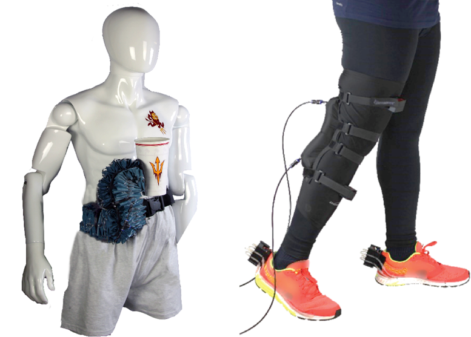

# Research Test

The overarching goal of our research is to develop novel learning and 
control algorithms to enable robots to safely and efficiently collaborate 
with humans and other robots to complete complex tasks. The algorithms are 
applied to various robot platforms, including [wearable robotics](#wearable-robotics), [soft robotics](#soft-robotics), 
[unmanned aerial vehicles](#unmanned-aerial-vehicles), and [robot manipulators](#human-robot-collaboration). Please check the summary of each 
project below and feel free to contact us if you have any questions or want to know more details!

We greatly acknowledge the National Science Foundation, Office of Naval Research, 
Science Foundation Arizona, Arizona Department of Health Services, Salt River Project, Northrop Grumman Cooperation, 
and several internal funding sources, for supporting our past and current research.

## Template Robotics

Soft robotics is reshaping the future of technology by developing flexible, adaptable systems that safely interact with humans and operate in complex environments. By utilizing soft, deformable materials, this work focuses on creating robots that address real-world challenges across various industries. Current projects include a precision-engineered soft robotic arm designed for advanced modeling and control, pneumatic fabric-based exosuits that offer personalized support for individuals in rehabilitation, and a soft pipe inspection robot capable of navigating intricate pipelines to ensure safe and efficient maintenance. These technologies aim to improve quality of life, enhance mobility, and enable safer infrastructure management. The driving mission is to push the boundaries of robotics through human-centered, adaptable designs that meet the growing demand for innovative solutions in healthcare, industry, and beyond, offering systems that are not only efficient but also intuitive in their interaction with people.

<!-- Tab links -->

  <button class="tablinks" onclick="openCity(event, 'Publications')" id="defaultOpen">Publications</button>
  <button class="tablinks" onclick="openCity(event, 'Projects')">Projects</button>
  <button class="tablinks" onclick="openCity(event, 'Outreach')">Outreach</button>

<!-- Tab content -->

  <h3>Publications</h3>
  
London is the capital city of England.

  <h3>Projects</h3>
  <h4>Soft Robotic Arm</h4>
  - Goal
    - Modeling and control of a soft robotic arm
  - Project Description
    - Work on pneumatically operated soft robotic arm to test, train and implement models and develop control algorithms to achieve tasks including but not limited to trajectory tracking.
  - Looking for:
    - Modify/upgrade the design of soft robotic arm and evaluation protocol for different experiments.
	- Identify and implement different types of input/output data collection trials to train/test models.

  <h3>Outreach</h3>
  
Tokyo is the capital of Japan.

Weija Tao

Jahnav Rokalaboina

Raj Kodithyala

Chach Chaimongkol

## Wearable Robotics
The aging population and neurological disorders such as stroke 
and Parkinson's disease lead to increased walking impairments. 
Traditional gait rehabilitation techniques involve multiple 
training sessions supervised by physical therapists. This paradigm 
is physically demanding for therapists, inconvenient for patients, 
and expensive for the entire healthcare system. Wearable assistive 
robots have been shown effective in restoring lost motor functions 
and improve training performance. We have developed intent estimation 
and adaptive control algorithms to personalize the robot assistance 
for different users in various tasks.

This project has been supported by the National Science Foundation and Science Foundation Arizona.


{: style="width: 465px; float: right; border: 10px"}

<iframe width="450" height="253" src="https://www.youtube.com/embed/E2N7_usONDs" frameborder="0" allowfullscreen></iframe>

 &nbsp; 

## Soft Robotics
This rapidly growing research field of soft robotics combines robotics 
and materials engineering, to pre-program complex motions into flexible 
and compliant materials. These soft systems are engineered using low-cost
fabrication techniques, providing adaptable morphology in response to 
environmental changes, and are ideally suited for manipulating delicate objects 
and interfacing with the human body. We are particularly interested in developing 
soft robotic systems that assist or augment human capabilities. To this end, 
we are currently exploring two wearable soft robot systems: a soft supernumerary arm 
for power augmentation (left) and a soft exosuit for walking assistance (right). We collaborate
with the neurorehabiltiation center at the Barrow Neurological Institute to evaluate the soft robotic exosuit
for assistance and rehabilitation.  

This project has been supported by the National Science Foundation, Arizona Department of Healthcare Services, and 
Global Sport Institute at ASU. 


<table width="876">
	<tr>
		<td width="438">
			
			
		</td>
		<td width="438">
			<iframe width="437" height="245" src="https://www.youtube.com/embed/zNls8IiVqg8" frameborder="0" allowfullscreen></iframe>
		</td>
	</tr>
	<tr>
		<td width="438">
			<iframe width="437" height="245" src="https://www.youtube.com/embed/3QqwjNVIfeo?start=39" title="YouTube video player" frameborder="0" allow="accelerometer; autoplay; clipboard-write; encrypted-media; gyroscope; picture-in-picture; web-share" allowfullscreen></iframe>
		</td>
		<td width="438">
			<iframe width="437" height="245" src="https://www.youtube.com/embed/n7Hid2VH8OA" title="YouTube video player" frameborder="0" allow="accelerometer; autoplay; clipboard-write; encrypted-media; gyroscope; picture-in-picture; web-share" allowfullscreen></iframe>
		</td>
	</tr>
</table>

 &nbsp; 

## Unmanned Aerial Vehicles
Unmanned aerial vehicles (UAVs) are popular in various applications, such as 
aerial photography, surveillance, search and rescue, and precision agriculture. However, 
autonomous operations of small UAVs in dynamic environments pose challenges on the design of vehicle hardware and 
the embedded autonomy algorithms. Our research in this area includes (1) exploring the design of morphing UAVs, 
(2) developing dynamic models and precision control algorithms for the new hardware, and (3) demonstrating aerial-physical
interaction for navigation and manipulation.

This project has been supported by the Salt River Project and the Northrop Grumman Corporation (through the Adaptive Intelligent Materials & Systems Center (AIMS) at ASU).


{: style="width: 375px; float: right; border: 10px"}

<iframe width="500" height="281" src="https://www.youtube.com/embed/ETKrxgVHOgY" frameborder="0" allowfullscreen></iframe>

 &nbsp; 

## Human-Robot Collaboration
Robots are increasingly employed in close proximity to humans. For the humans and robots to collaborate safely and 
efficiently, a robot needs to understand human intents, predict human actions, consider human factors, in order to optimize its own actions to 
complete a task with human safely, efficiently, and friendly. Here we will explore a game-theoretic framework to model the bilateral inference 
and decision making process between the human and robot. We are interested in both proximal and physical tasks that involve 
joint decision-making and joint-action between the human and robot. One major challenge is to model the human actions in highly dynamic tasks given 
the strong variability and uncertainty of humans. We will apply the developed algorithms in various human-robot collaboration 
scenarios, including autonomous vehicles, collaborative manufacturing, wearable robots, and assistive devices. For more details about how we apply the developed algorithms to autonomous vehicles, please check [this page]({{ site.url }}{{ site.baseurl }}/nri.html).

This project has been supported by the National Science Foundation. For more details about this project, please check [this page]({{ site.url }}{{ site.baseurl }}/nri.html).


{: style="width: 375px; float: right; border: 10px"}

<iframe width="500" height="281" src="https://www.youtube.com/embed/luX1xlsm6UQ" frameborder="0" allowfullscreen></iframe>

 &nbsp; 
